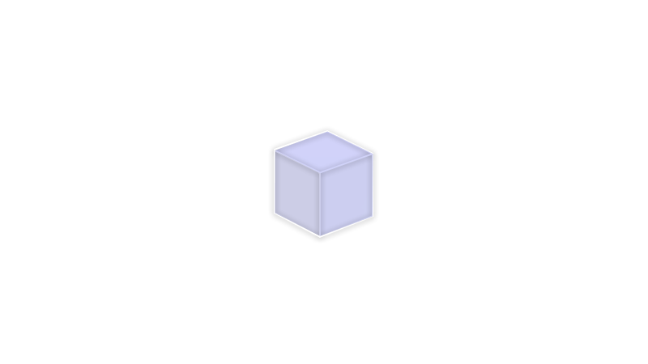

<p>
  
  <h2>Blank</h2>
  <blockquote>Absolute flexibility. All you need to let your imagination flow.</blockquote>
</p>

### ⚠️ How to use:
When you first build your page with the theme, you'll notice nothing shows up. This is intentional, as it's up to you to use the data to build your layout.

The [PRSS Client Library](https://github.com/prss-io/prss-client/blob/master/src/index.js), is already loaded with the Theme. Use its methods to render your content.

For example:
```html
<main>
    <h1></h1>
    <div class="content"></div>
</main>
<script>
    const setContent = (selector, html) => document.querySelector(selector).innerHTML = html;
    const { item } = PRSS.getAllProps();
    /*
    Returns: {
      "uuid":"fffb7461-1380-46d2-bca5-70696b1cda1c",
      "slug":"home",
      "title":"Home",
      "content":"<p>This is the beginning of something great.</p>",
      "template":"home",
      "updatedAt":1713499483159,
      "createdAt":1713390209013,
      "vars":{}
    }
    */
    setContent("h1", item.title);
    setContent(".content", item.content);
</script>

```


<div align="right">
  <p><a href="https://prss.io"></a></p>
</div>
